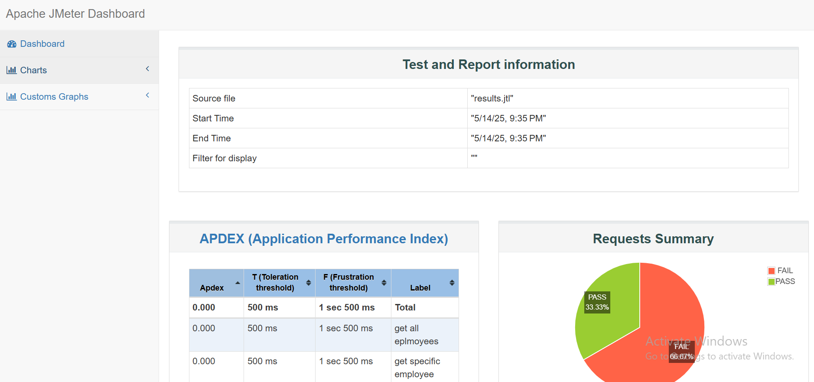

# 🧪 Apache JMeter Employee API Load Test
### 📸 Sample HTML Report Screenshot:


This project demonstrates how to use **Apache JMeter** to test a **REST API** for performance and generate an HTML report. The API used is a public dummy API:

🔗 [https://dummy.restapiexample.com/]
---
## 🧰 Step-by-Step Setup & Execution

### ✅ 1. Install Java JDK

JMeter requires Java to run.

1. Download the Java JDK (version 8 or later) from:
   - [Oracle JDK](https://www.oracle.com/java/technologies/javase-downloads.html)

2. Install it and configure `JAVA_HOME`:
   - Go to: `System Properties` → `Environment Variables`
   - Add a new system variable:
     ```
     JAVA_HOME = C:\Program Files\Java\jdk-<your-version>
     ```
   - Add to the system `Path`:
     ```
     %JAVA_HOME%\bin
     ```
3. Verify the installation:
   ```bash
   java -version
## 🧪 2. Install Apache JMeter

1. Download Apache JMeter from the official website:  
   👉 [https://jmeter.apache.org/download_jmeter.cgi](https://jmeter.apache.org/download_jmeter.cgi)

2. Extract the downloaded `.zip` file to a directory of your choice, for example:C:\apache-jmeter-5.6.3\
3. Navigate to the `bin` folder:
cd C:\apache-jmeter-5.6.3\bin & Run JMeter double click on jmeter.bat file

## 🧪 3. Create Demo Test Plan (Employee API)

We will create a simple test plan in JMeter that sends HTTP GET requests to a public dummy API.

### 🔗 API Base URL:

### 🛠 Steps to Create the Test Plan:

1. **Open JMeter GUI** by running `jmeter.bat` from the `/bin` directory.

2. **Add Thread Group:**
   - Right-click on **Test Plan** → Add → Threads (Users) → Thread Group
   - Configure:
     - Number of Threads (users): `2`
     - Ramp-up period: `1`
     - Loop count: `1`

3. **Add HTTP Request Sampler:**
   - Right-click on **Thread Group** → Add → Sampler → HTTP Request
   - Set the following:
     - **Protocol**: `https`
     - **Server Name or IP**: `dummy.restapiexample.com`
     - **Method**: `GET`
     - **Path**: `/api/v1/employees` (To get all employees)

4. **Add Listeners to view results:**
   - Right-click on **Thread Group** → Add → Listener → 
     - View Results Tree
     - View Results in Table
     - Summary Report

5. **Save the Test Plan:**
   - File → Save As → `EmployeeAPITest.jmx`

6. **Run the Test:**
   - Click the green ▶️ button on the top toolbar.

7. **Verify Response:**
   - Open **View Results Tree** → Select any request → Check **Response Data** to see API results.

## 📊 4. Generate HTML Report

After running your JMeter test, you can generate a beautiful and detailed HTML report using the `.jtl` result file.

### 🧾 Steps to Generate HTML Report:

1. **Run your test with result logging:**
   - Open Command Prompt.
   - Navigate to your JMeter `bin` folder:
     ```bash
     cd C:\apache-jmeter-5.6.3\bin
     ```
   - Run the test with result logging:
     ```bash
     jmeter -n -t "C:\Path\To\Your\EmployeeAPITest.jmx" -l "results.jtl" -e -o "HTMLReport"
     ```

     🔹 `-n`: Non-GUI mode  
     🔹 `-t`: Path to your `.jmx` test plan  
     🔹 `-l`: Path to save result file (`.jtl`)  
     🔹 `-e`: Generate report dashboard  
     🔹 `-o`: Output folder for HTML report

2. **Open the HTML report:**
   - After execution, go to the `HTMLReport` directory.
   - Open `index.html` in your browser.

3. ✅ The HTML report will include:
   - Summary Dashboard
   - Request summary (pass/fail)
   - APDEX score
   - Graphs, tables, and performance metrics


